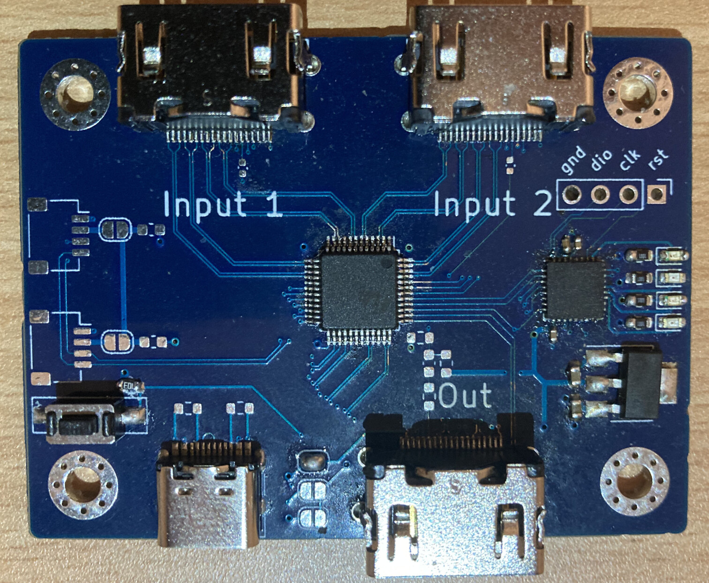

## USB controlled HDMI Switch

I couldn't find one of these easily, so I decided to make one myself.

This uses a PI3HDX621 `3.4Gbps HDMI1.4b Active 2:1 Switch with ARC and Fast Switching` paired with a SAMD21 microcontroller (because I had some in stock).

The firmware is implemented with my library [libsam](https://github.com/Stary2001/libsam).

Untested things - the switch IC supports ARC, but I didn't test that yet because I don't have anything handy that supports it.